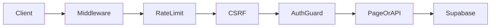

# Architecture

## Stack

| Layer | Technology |
|-------|------------|
| Frontend | Next.js 15 App Router, React 19, Tailwind CSS 4 |
| Auth | Supabase Auth + `@supabase/ssr` |
| Database | Supabase PostgreSQL |
| Storage | Supabase Storage |
| Validation | Zod |

## Directory layout

```
src/
├── app/                    # Routes (storefront + admin + API)
│   ├── admin/(protected)/  # Admin modules (RBAC guarded)
│   └── api/                # Route handlers (health, webhooks)
├── components/             # UI components (unchanged in Phase 5.0)
├── lib/
│   ├── admin/              # Server queries & actions per domain
│   ├── auth/               # Permissions, guards, roles
│   ├── security/           # Headers, rate limit, CSRF, secrets
│   ├── observability/      # Logging, request IDs, error tracking hooks
│   └── supabase/           # Client factories & types
├── middleware.ts           # Auth + security for /admin and /api
└── instrumentation.ts      # Startup env validation

supabase/database/          # Ordered SQL migrations (001–021)
tests/                      # Vitest + Playwright
docs/                       # Guides and checklists
```

## Request flow



## Security

- **CSP** — `src/lib/security/headers.ts` + `next.config.ts`
- **Rate limiting** — in-memory per IP on `/admin/*` and `/api/*`
- **CSRF** — Origin/Referer validation on API mutations
- **HSTS** — enabled in production only
- **Secure cookies** — documented defaults in `src/lib/security/cookies.ts`
- **Secrets** — `SUPABASE_SERVICE_ROLE_KEY` server-only via `src/lib/security/secrets.ts`

## Observability

- Structured JSON logging (`src/lib/observability/logger.ts`)
- Request ID / correlation ID headers on every middleware response
- `GET /api/admin/audit-logs` — read-only audit API (requires `settings.manage`)
- `GET /api/admin/metrics` — performance placeholder (requires `reports.view`)

## Module map

| Module | Route prefix | Permission |
|--------|--------------|------------|
| Catalog | `/admin/products` | `catalog.manage` |
| Orders | `/admin/orders` | `orders.manage` |
| Customers | `/admin/customers` | `customers.manage` |
| Finance | `/admin/finance` | `finance.view` |
| Marketing | `/admin/marketing` | `marketing.view` |
| Reports | `/admin/reports` | `reports.view` |

## Future integrations (placeholders)

Payment gateways, email (Brevo/SendGrid), WhatsApp (Meta), error tracking (Sentry) — architecture ready, not connected.
