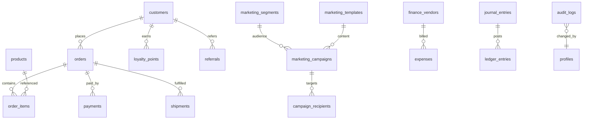

# Entity Relationship Overview

Full schema: apply migrations `001`–`021` in `supabase/database/`.

## Core entities

- **Catalog:** products, categories, brands, variants
- **Operations:** orders, inventory, warehouses, shipments
- **CRM:** customers, reviews, returns
- **Finance:** expenses, ledger, GST, vendors, bank reconciliation
- **Marketing:** campaigns, segments, templates, automation, queues
- **System:** audit_logs, permissions, roles, settings
